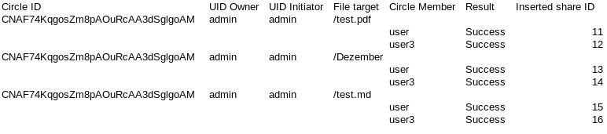

# Nextcloud Share Tools

Supported commands:

- Migrate Circle Shares: PHP script to migrate all shares to nextcloud circles, which get replaced by shares to the individual circle members. The script writes all migrated shares into CSV files.
- Create Calendar Shares: Share all calendars to a single user



## Setup
Create `.env.local` file and set database connection params.
```console
cp .env .env.local
```

## Usage
- List all commands
```console
php app.php
```
- Run migration
```console
php app.php migrate
```

## Development

Install all dependencies including dev dependencies:
```console
composer i
```

## Tests

Install first all dependencies like in the section before.
Also make sure to set up a mysql database. This is not included in the test setup.
Then run all tests:
```console
vendor/bin/phpunit tests
```

## Deployment

Skip dev dependencies during installation:
```console
composer i --no-dev
```
